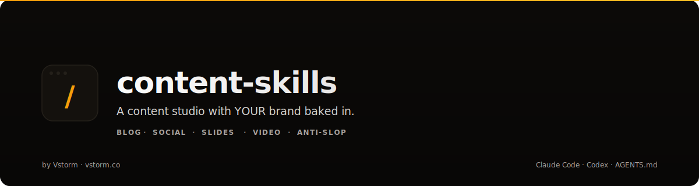

<h1 align="center">Content Skills</h1>

<p align="center">
  
</p>

<p align="center">
  <b>Content studio with YOUR brand baked in.</b><br>
  Skill pack — strategy, writing, slides, graphics, video, scheduling — all aligned to your brand identity. Works with Claude Code, Codex, and any AGENTS.md-compatible agent CLI.
</p>

<p align="center">
  <a href="#-quick-start">Install</a> &middot;
  <a href="#-commands">Commands</a> &middot;
  <a href="#-the-brand-system">Brand System</a> &middot;
  <a href="#-the-anti-slop-mission">Anti-Slop</a> &middot;
  <a href="#-the-full-content-pipeline">Pipeline</a>
</p>

<p align="center">
  <a href="https://github.com/vstorm-co/content-skills/stargazers"></a>
  <a href="https://www.python.org/downloads/"></a>
  <a href="https://opensource.org/licenses/MIT"></a>
  <a href="https://claude.ai/claude-code"></a>
  <a href="https://agents.md/"></a>
  <a href="https://vstorm.co"></a>
  <a href="https://x.com/Kacper95682155"></a>
</p>

---

## Why Content Skills Matter (2026)

AI generates content fast. **content-skills** generates content that doesn't smell like AI AND actually sounds like YOU.

| Metric | Value |
|--------|-------|
| Creator economy size (2026)         | $480B+  |
| Creators using AI daily             | 82%     |
| Readers who identify "AI slop"      | 76%     |
| Engagement drop on AI-detected      | -47%    |
| Creators multi-platform             | 91%     |
| Avg content tools per creator       | 9       |
| Brand-inconsistent outputs in AI    | 93%     |

**Two problems: content looks AI-generated, and it doesn't look like YOU. This skill bundle solves both.**

---

## 🚀 Quick Start

### One-Command Install (macOS & Linux)

```bash
curl -fsSL https://raw.githubusercontent.com/vstorm-co/content-skills/main/install.sh | bash
```

The installer mirrors skills into both `~/.claude/` and `~/.agents/` — so the same install works with Claude Code, Codex, or any AGENTS.md-compatible agent CLI without extra steps.

### Manual Install

```bash
git clone https://github.com/vstorm-co/content-skills.git
cd content-skills
./install.sh
```

### Requirements

- **An agent CLI** — [Claude Code](https://claude.ai/claude-code), [Codex](https://github.com/openai/codex), or any [AGENTS.md](https://agents.md/)-compatible agent
- **Python 3.10+** — for scripts (anti-slop checker, readability scorer, scaffolders)
- **Git** — for cloning

### Get Started

Set up your brand (5 minutes, one-time):

```
/content setup
```

Then create anything:

```
/content blog "thread injection defense in LLM agents"
/content presentation "pitch deck for our AI agent platform"
/content twitter "why most AI-generated content sucks"
```

### Uninstall

```bash
curl -fsSL https://raw.githubusercontent.com/vstorm-co/content-skills/main/uninstall.sh | bash
```

Your `brand/` directory is preserved — only skill files are removed.

---

## 🎨 The Brand System

Run `/content setup` once. The skill interviews you about:
- Who you are and what you do
- Your audience
- Your writing voice (with examples)
- Visual identity (colors, fonts, logo)
- Platforms you publish on

Creates a `/brand/` directory in your project:

```
brand/
├── BRAND.md       # Master brand definition
├── VOICE.md       # Your writing voice
├── VISUAL.md      # Colors, fonts, logo specs
├── logo/          # Drop your logo files here
├── fonts/         # Self-hosted fonts
├── assets/        # Avatars, backgrounds, etc.
└── voice-samples/ # Your best writing examples
```

Every content skill automatically reads from `/brand/`. Your blog posts, threads, slide decks, and videos all look and sound consistent.

---

## 🧰 Commands

| Command                         | What It Does |
|----------------------------------|--------------|
| `/content setup`                 | Interactive brand onboarding |
| `/content brand show`            | View current brand |
| `/content brand update`          | Modify brand |
| `/content voice <samples>`       | Learn voice from samples |
| `/content plan <topic>`          | 30-day editorial calendar |
| `/content brief <idea>`          | Idea to full brief |
| `/content blog <brief>`          | Long-form blog post |
| `/content twitter <topic>`       | X thread or single |
| `/content linkedin <topic>`      | LinkedIn post |
| `/content reddit <topic>`        | Subreddit-aware post |
| `/content hn <project>`          | Show HN post |
| `/content presentation <brief>`  | HTML presentation (Slidev/Reveal/Spectacle) |
| `/content infographic <data>`    | SVG infographic |
| `/content image <prompt>`        | Optimize image prompts |
| `/content video <brief>`         | Remotion video + storyboard |
| `/content repurpose <source>`    | 1 format to 5+ formats |
| `/content audit <draft>`         | Anti-slop + brand consistency |
| `/content series <theme>`        | 10-post connected series |
| `/content score`                 | Quick check — is this ready to ship? |

---

## 🛡 The Anti-Slop Mission

Readers detect AI-generated content in 3 seconds. Common tells:
- "Let's dive in!" openings
- All paragraphs same length
- Em-dash abuse
- Generic metaphors (game-changer, paradigm shift)
- "In today's fast-paced world..."

**content-audit catches all of these. AND checks if it sounds like YOU.**

Audit output includes:
- Anti-slop: X/100
- Voice consistency with YOUR brand: X/100
- Visual consistency: X/100 (for visual content)
- Overall brand alignment: X/100

---

## ✨ Before / After

**Blog intro — without brand:**
> In today's fast-paced world of AI, it's more important than ever to understand prompt injection. Let's dive in and explore this fascinating topic...

**Same brief — with `/content setup` + brand:**
> Thread injection hit 3 production agents last week. Two had guardrails. Here's what went wrong and the 4-line fix that stopped it.

**Presentation — without brand:**
Default template. Inter font. Purple gradient. Slide 1: "Agenda." Generic bullet points.

**Same deck — with brand:**
Your colors. Your fonts. Your logo on every slide. Speaker notes in your voice. No "agenda" slide — structure emerges from narrative.

**`/content audit` catches the difference:**
```
Anti-slop:           87/100
Voice consistency:   94/100
Visual consistency:  91/100
Brand alignment:     91/100
```

---

## 🔄 The Full Content Pipeline

```bash
# One-time setup
/content setup

# Weekly workflow
/content plan "AI agent security"              # Monday: plan month
/content brief "prompt injection in 2026"      # Tuesday: develop idea
/content blog <brief>                          # Wednesday: write post
/content repurpose <post.md>                   # Thursday: spin to thread + LinkedIn
/content infographic <post.md>                 # Friday: visual
/content presentation <post.md>                # Next week: conference talk
/content video <post.md>                       # Later: YouTube explainer
/content audit <everything>                    # Before publishing anything
```

Every output matches your brand. Every output fights AI slop.

---

## 🎤 Presentations

`/content presentation` generates full presentations in:
- **Slidev** (markdown-first, code-heavy talks) — default for developer content
- **Reveal.js** (classic, maximum compatibility)
- **Spectacle** (React-based, custom components)
- **Raw HTML** (single portable file, no build)

All presentations automatically use `/brand/`:
- Your colors on every slide
- Your fonts imported correctly
- Your logo on title slide + footer
- Your voice in speaker notes

---

## 🗣 Voice Profiles

Drop 3-5 of your best writing pieces in `brand/voice-samples/`:

```
brand/voice-samples/
├── my-best-thread.md
├── last-blog-post.md
└── favorite-linkedin-post.md
```

Then run:

```
/content voice brand/voice-samples/
```

Skill analyzes patterns — sentence rhythm, signature phrases, vocabulary, structural moves — and updates `brand/VOICE.md`.

Next blog post: in YOUR voice. Not GPT's.

---

## 🏗 Architecture

```
content-skills/
├── content/                 # Main router skill
│   └── SKILL.md
├── brand/                   # Brand source of truth (created by /content setup)
│   ├── BRAND.md
│   ├── VOICE.md
│   ├── VISUAL.md
│   ├── logo/
│   ├── fonts/
│   ├── assets/
│   ├── palettes/
│   └── voice-samples/
├── skills/                  # 14 specialized sub-skills
│   ├── content-setup/
│   ├── content-strategy/
│   ├── content-blog/
│   ├── content-twitter/
│   ├── content-linkedin/
│   ├── content-reddit/
│   ├── content-hackernews/
│   ├── content-presentation/
│   ├── content-infographic/
│   ├── content-image/
│   ├── content-video/
│   ├── content-calendar/
│   ├── content-repurpose/
│   └── content-audit/
├── agents/                  # Parallel subagent definitions
├── scripts/                 # Python utilities
├── styles/                  # Default style tokens
├── assets/                  # Shared assets
├── install.sh
└── uninstall.sh
```

---

## Contributing

Pull requests welcome. Pattern to add new skills:

1. Create skill directory in `skills/content-<name>/`
2. Add `SKILL.md` with frontmatter (name, description) and content
3. Add to orchestrator router in `content/SKILL.md`
4. Optional: agents in `agents/`, scripts in `scripts/`, style tokens in `styles/`

---

## Vstorm OSS Ecosystem

**content-skills** is part of a broader open-source ecosystem for production AI agents:

| Project | Description | |
|---------|-------------|---|
| **[pydantic-deep](https://github.com/vstorm-co/pydantic-deep)** | The batteries-included deep agent harness for Python. Terminal AI assistant or production agents with one function call. | [](https://github.com/vstorm-co/pydantic-deep) |
| **[full-stack-ai-agent-template](https://github.com/vstorm-co/full-stack-ai-agent-template)** | Zero to production AI app in 30 minutes. FastAPI + Next.js 15, 6 AI frameworks, RAG pipeline, 75+ config options. | [](https://github.com/vstorm-co/full-stack-ai-agent-template) |
| **[production-stack-skills](https://github.com/vstorm-co/production-stack-skills)** | Claude Code skills for production-grade FastAPI, PostgreSQL, Docker, and observability. | [](https://github.com/vstorm-co/production-stack-skills) |
| **[pydantic-ai-shields](https://github.com/vstorm-co/pydantic-ai-shields)** | Drop-in guardrails for Pydantic AI agents. 5 infra + 5 content shields. | [](https://github.com/vstorm-co/pydantic-ai-shields) |
| **[pydantic-ai-subagents](https://github.com/vstorm-co/pydantic-ai-subagents)** | Declarative multi-agent orchestration with token tracking. | [](https://github.com/vstorm-co/pydantic-ai-subagents) |
| **[summarization-pydantic-ai](https://github.com/vstorm-co/summarization-pydantic-ai)** | Smart context compression for long-running agents. | [](https://github.com/vstorm-co/summarization-pydantic-ai) |
| **[pydantic-ai-backend](https://github.com/vstorm-co/pydantic-ai-backend)** | Sandboxed execution for AI agents. Docker + Daytona. | [](https://github.com/vstorm-co/pydantic-ai-backend) |

Browse all projects at [oss.vstorm.co](https://oss.vstorm.co)

---

## License

MIT — see [LICENSE](LICENSE)

---

<div align="center">

### Need help scaling content without losing your voice?

<p>We're <a href="https://vstorm.co"><b>Vstorm</b></a> — an Applied Agentic AI Engineering Consultancy<br>running content across X, LinkedIn, Reddit, Medium, HN, plus Remotion video and Slidev talks. These skills are what we use.</p>

<a href="https://vstorm.co/contact-us/">
  
</a>

<br><br>

Made with **care** by <a href="https://vstorm.co"><b>Vstorm</b></a>

</div>
